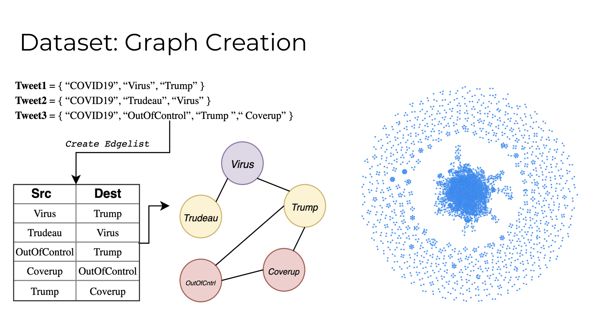
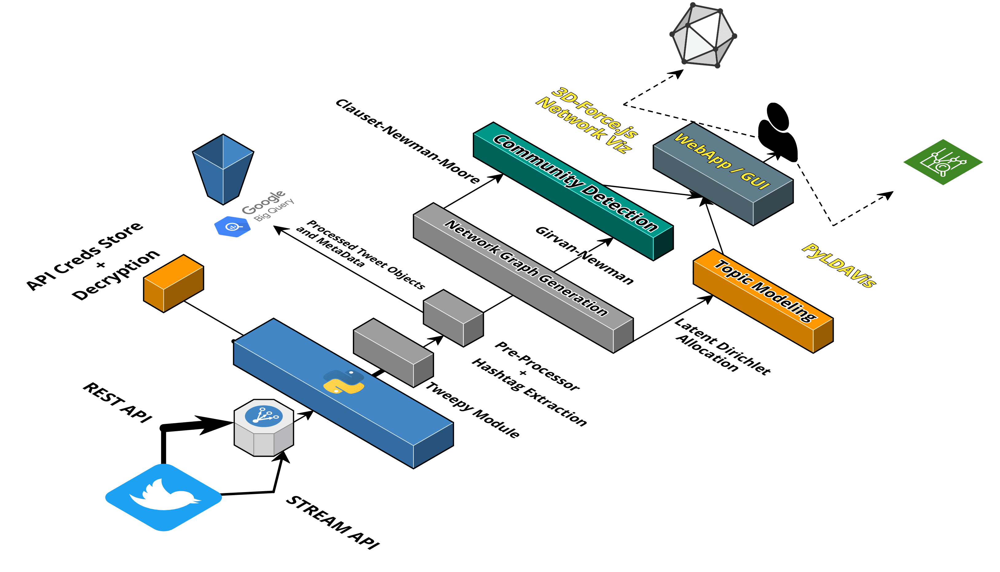

# Twitter-Graph-Clustering
[link to live version!](https://hashtag.surge.sh/)

Community detection algorithms on custom twitter hashtag networks

a tool leveraging network graph-based clustering for social networks interaction analysis, via custom Twitter Hashtag Networks. 

### Graph creation heuristic

### Schema

### 3D- Force graph

